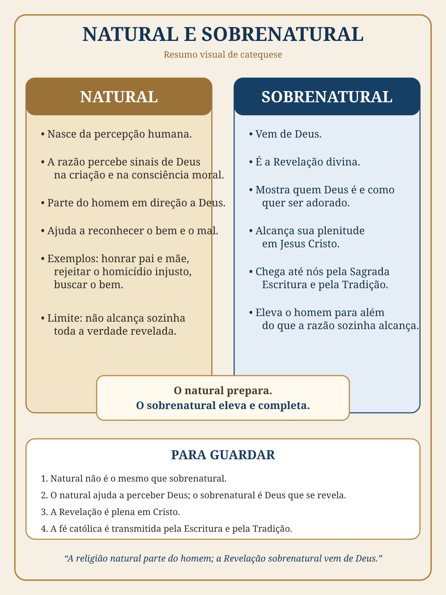

# Aula 01 — Origem do Catecismo e fontes da Revelação

**Professor:** Marco Antônio  
**Referência central:** Catecismo de São Pio X  
**Duração aproximada:** 1h12min

!!! info "Objetivo"
    Compreender a finalidade do Catecismo, distinguir religião natural e Revelação sobrenatural, identificar as etapas da Revelação e reconhecer a Sagrada Escritura e a Tradição como formas de transmissão da fé, segundo a exposição da aula.

## 1. Resumo essencial

A aula apresenta o Catecismo de São Pio X como instrumento de formação organizado para transmitir os fundamentos da fé de maneira clara. O professor parte da antiga prática de instrução dos **catecúmenos** e relaciona o desenvolvimento dos catecismos à necessidade de ensinar a doutrina de forma acessível.

Depois, distingue **religião natural** e **Revelação sobrenatural**. No vocabulário da aula, a religião natural parte da razão, da consciência e da percepção humana do bem, do mal e de Deus; a Revelação sobrenatural parte da iniciativa de Deus de se manifestar ao homem.

A exposição apresenta a Revelação como progressiva: patriarcas, Moisés e profetas, culminando em **Jesus Cristo**. A fé recebida é transmitida pela **Sagrada Escritura** e pela **Tradição apostólica**, e a Igreja é apresentada como responsável por guardar, transmitir e explicitar esse depósito da fé.

> **Frase para memorizar:** O Catecismo organiza para o aprendizado a fé transmitida pela Sagrada Escritura e pela Tradição.

## 2. Estudo por blocos

### Bloco 1 — Por que existe o Catecismo?

A catequese aparece como uma necessidade antiga: ensinar os fundamentos da fé a quem se preparava para o Batismo e também formar os fiéis. O formato catequético simplifica conteúdos complexos para favorecer compreensão, memória e aplicação.

**Para guardar:** catequese não é apenas decorar; é conhecer, compreender e viver a fé.

### Bloco 2 — Religião natural e consciência moral

O professor chama de religião natural a busca religiosa e moral que parte das capacidades naturais do homem. Exemplos usados na aula incluem reconhecer o dever de honrar os pais, condenar o homicídio injusto e buscar o bem.

{ .infografico }

| Natural | Sobrenatural |
|---|---|
| Parte da percepção e da razão humanas. | Vem da iniciativa de Deus. |
| O homem busca e percebe sinais de Deus. | Deus se revela ao homem. |
| Ajuda a reconhecer o bem e o mal. | Ultrapassa aquilo que a razão alcança sozinha. |
| Parte do homem em direção a Deus. | Vem de Deus em direção ao homem. |

!!! quote "Frase-chave"
    A religião natural parte do homem; a Revelação sobrenatural vem de Deus.

### Bloco 3 — Revelação sobrenatural e suas etapas

A Revelação sobrenatural é apresentada como iniciativa de Deus. A aula organiza esse desenvolvimento em etapas:

- **Patriarcas:** com destaque para Abraão.
- **Moisés e os profetas:** Lei, Dez Mandamentos e preparação para a vinda de Cristo.
- **Jesus Cristo e os apóstolos:** plenitude da Revelação em Cristo e transmissão apostólica.

**Para guardar:** Revelação progressiva → plenitude em Cristo → transmissão apostólica.

### Bloco 4 — Sagrada Escritura e Tradição

A aula enfatiza que a transmissão da Revelação não é apresentada somente pela Bíblia.

- **Sagrada Escritura:** os livros sagrados recebidos como inspirados.
- **Tradição apostólica:** transmissão da fé recebida pelos apóstolos de Cristo.

**Para guardar:** Escritura e Tradição são apresentadas como formas fundamentais de transmissão da Revelação.

### Bloco 5 — Depósito da fé, dogmas e método catequético

O professor usa a imagem de um **baú de tesouros** para representar o depósito da fé: um conteúdo recebido, guardado e explicado progressivamente. O Catecismo aparece como instrumento para tornar esse conteúdo mais acessível ao estudo.

**Para guardar:** explicar o depósito da fé não significa criar uma nova Revelação pública.

### Bloco 6 — Igreja, sucessão apostólica e papado

A Igreja é apresentada como guardiã e transmissora da Revelação. A aula menciona a controvérsia dos **lapsi** como exemplo histórico relacionado à autoridade eclesial e à disciplina da comunidade cristã.

### Bloco 7 — Perguntas do público e aplicações

Na parte final, o professor retoma temas como natureza humana, razão, teologia, Didaqué e orientação de estudo. A recomendação prática é construir primeiro uma base catequética antes de avançar para obras mais complexas.

## 3. Mapa mental da aula

```text
CATECISMO DE SÃO PIO X
├── Finalidade → ensinar os fundamentos da fé
├── Religião natural → razão e consciência
├── Revelação sobrenatural → iniciativa de Deus
│   ├── Patriarcas
│   ├── Moisés e profetas
│   └── Jesus Cristo
├── Transmissão → Escritura + Tradição
├── Igreja → guarda e transmite o depósito da fé
└── Catecismo → organiza para estudar e memorizar
```

## 4. Pontos para memorizar

1. O Catecismo é instrumento de **instrução da fé**.
2. Religião natural e Revelação sobrenatural não são a mesma coisa.
3. A Revelação alcança sua plenitude em **Jesus Cristo**.
4. **Sagrada Escritura e Tradição** são conceitos fundamentais da aula.
5. O método catequético favorece compreensão, revisão e memória.

## 5. Dicionário da aula

- **Catecúmeno:** pessoa que recebe instrução nos fundamentos da fé enquanto se prepara para o Batismo.
- **Catequese:** instrução e formação na fé cristã.
- **Religião natural:** busca religiosa e moral que parte das capacidades naturais do ser humano, conforme a terminologia da aula.
- **Revelação sobrenatural:** manifestação de Deus ao homem que ultrapassa aquilo que a razão descobriria sozinha.
- **Patriarca:** ancestral de referência na história do povo de Israel; a aula destaca Abraão.
- **Monoteísmo:** crença em um único Deus.
- **Politeísmo:** crença em vários deuses.
- **Sagrada Escritura:** conjunto dos livros bíblicos recebidos como inspirados.
- **Tradição apostólica:** transmissão da fé recebida pelos apóstolos de Cristo.
- **Depósito da fé:** conjunto da Revelação confiada à Igreja para guarda e transmissão.
- **Dogma:** verdade de fé proposta definitivamente pela autoridade da Igreja.
- **Cânon bíblico:** conjunto dos livros reconhecidos como integrantes da Bíblia.
- **Escolástica:** tradição medieval de investigação e ensino que empregou a razão na reflexão teológica.
- **Lapsi:** cristãos que abandonaram ou negaram a fé em situações de perseguição.
- **Didaqué:** antigo escrito de instrução moral e prática das comunidades cristãs.
- **Opúsculo:** obra curta.

## 6. Perguntas e respostas para revisão

1. **Quais são as duas bases propostas para o curso?**  
   Os fundamentos da doutrina e sua aplicação ao estudo e à vida cotidiana.

2. **Quem eram os catecúmenos?**  
   Pessoas em preparação para o Batismo, instruídas nos fundamentos da fé.

3. **Qual a diferença entre religião natural e Revelação sobrenatural?**  
   A primeira parte das capacidades naturais humanas; a segunda parte da iniciativa divina de se revelar.

4. **Quem recebe destaque na formação do povo escolhido?**  
   Abraão.

5. **O que muda com Moisés?**  
   A aula destaca a Lei, os Dez Mandamentos e a organização religiosa e social do povo.

6. **Em quem a Revelação alcança sua plenitude?**  
   Em Jesus Cristo.

7. **Quais são as duas formas de transmissão destacadas?**  
   Sagrada Escritura e Tradição apostólica.

8. **O que representa o baú de tesouros?**  
   O depósito da fé recebido e progressivamente explicitado.

9. **Quem eram os lapsi?**  
   Cristãos que abandonaram ou negaram a fé durante perseguições.

10. **Qual orientação é dada aos iniciantes?**  
    Construir primeiro uma base catequética antes de avançar para estudos mais complexos.

## 7. Revisão ativa

- [ ] Consigo explicar a finalidade do Catecismo.
- [ ] Sei distinguir natural e sobrenatural.
- [ ] Consigo reconstruir as etapas da Revelação.
- [ ] Sei explicar Escritura e Tradição.
- [ ] Respondi o questionário sem consultar a aula.
- [ ] Fiz uma revisão após 24 horas.
- [ ] Fiz outra revisão após sete dias.

➡️ [Abrir questionário objetivo da Aula 01](../questionarios/aula-01.md)

## 8. Pontos para aprofundar

Alguns detalhes históricos narrados em aula merecem consulta específica antes de serem memorizados como fatos — especialmente cronologias medievais, episódios do papado, formação do Colégio Cardinalício e certas atribuições históricas usadas como exemplos.

## 9. 🎥 Resumo para treino em vídeo

Olá! Nesta aula eu aprendi que o Catecismo serve para organizar e transmitir de forma clara os fundamentos da fé católica.

Também vimos a diferença entre o **natural e o sobrenatural**. O natural parte daquilo que o ser humano consegue perceber pela razão, pela consciência e pela observação da criação. Já o sobrenatural acontece quando **Deus toma a iniciativa de se revelar ao homem**.

A aula mostra ainda que essa Revelação alcança sua plenitude em Jesus Cristo e é transmitida pela **Sagrada Escritura e pela Tradição**.

> **Frase para treinar:** o natural parte do homem em direção a Deus; o sobrenatural vem de Deus em direção ao homem.

**Palavras-chave para falar sem ler:** Catecismo · Natural · Revelação · Tradição
