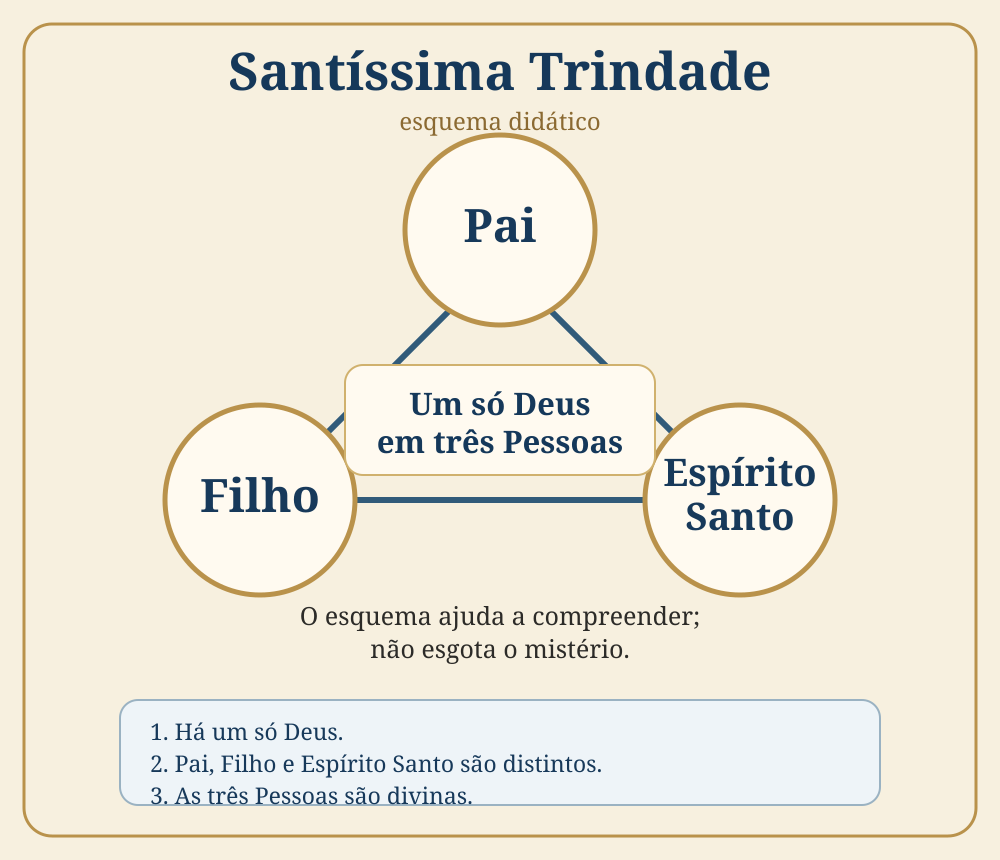

# Aula 02 — Magistério da Igreja, Sagrada Escritura e o Credo

**Professor:** Marco Antônio  
**Referência central:** Catecismo de São Pio X  
**Duração aproximada:** 1h10min  
**Origem:** transcrição enviada pelo estudante

!!! info "Objetivo"
    Compreender, segundo a exposição da aula, a relação entre Tradição, Sagrada Escritura e Magistério; perceber o papel atribuído à Igreja na interpretação da Revelação; introduzir o Credo como símbolo da fé; e compreender a distinção entre aquilo que a razão alcança e os mistérios que a Revelação apresenta como superiores à razão.

## 1. Resumo essencial

A aula retoma a afirmação de que **Tradição e Sagrada Escritura** são fontes da Revelação e acrescenta um terceiro elemento decisivo na exposição do professor: o **Magistério da Igreja**, apresentado como autoridade responsável por reconhecer, interpretar e transmitir corretamente o conteúdo revelado.

O professor aplica essa ideia à formação do cânon bíblico, à tradução e leitura da Bíblia e à rejeição do chamado **livre exame**. Dá destaque à **Vulgata de São Jerônimo** como referência tradicional e apresenta o Magistério como critério para evitar interpretações isoladas da Escritura.

Na segunda metade, a aula passa ao **Credo**, descrito como **símbolo daquilo que o cristão crê**. A partir daí, o professor introduz a relação entre **fé e razão**: a Revelação pode ultrapassar os limites naturais da razão sem, segundo sua explicação, contradizê-la. A **Santíssima Trindade** é usada como exemplo de mistério que pode ser aproximado racionalmente, mas não plenamente compreendido nesta vida.

A aula termina retomando o **depósito da fé** como critério de continuidade doutrinária e preparando o estudo dos artigos do Credo.

> **Frase para memorizar:** a Escritura e a Tradição são lidas, na aula, sob a luz do Magistério; a fé acolhe racionalmente verdades que podem ultrapassar aquilo que a razão alcança sozinha.

## 2. Estudo por blocos

### Bloco 1 — Tradição e Sagrada Escritura (00:00–03:30)

A aula começa retomando o conteúdo anterior. O professor afirma que **Tradição e Sagrada Escritura possuem autoridade como fontes da Revelação**, destacando a antiguidade e a amplitude da tradição oral. Para ele, a Escritura não deve ser considerada isoladamente da Tradição que a precede e acompanha.

**Para guardar:** a aula apresenta Escritura e Tradição como realidades interligadas, não concorrentes.

### Bloco 2 — O Magistério da Igreja (03:31–06:42)

O professor introduz o **Magistério** como autoridade da Igreja para reconhecer quais escritos são inspirados e para orientar o sentido da Revelação transmitida. Na exposição, o Magistério funciona como referência interpretativa para a leitura da Bíblia e da Tradição.

Ele insiste que o fiel **pode e deve ler a Sagrada Escritura**, mas sustenta que essa leitura precisa permanecer ligada ao ensinamento da Igreja.

**Para guardar:** no esquema apresentado, temos **Revelação → Escritura e Tradição → Magistério como autoridade interpretativa**.

### Bloco 3 — São Jerônimo, Vulgata e tradução bíblica (06:43–13:24)

O professor dedica um bloco à **Vulgata**, tradução latina associada a São Jerônimo. Apresenta-a como tradução de grande autoridade na tradição católica e usa o episódio dos “chifres” ou “esplendores” de Moisés para explicar problemas de tradução e interpretação.

Também faz uma avaliação crítica de traduções modernas e recomenda, para o estudante iniciante, versões que considera mais próximas da Vulgata.

**Para guardar:** esta parte da aula defende que a tradução bíblica não é apenas uma troca de palavras; ela envolve interpretação, tradição e critérios eclesiais.

### Bloco 4 — Autoria bíblica, contexto antigo e cânon (13:25–24:45)

A aula discute a diversidade de estilos dentro dos textos bíblicos. O professor contesta a ideia de que estilos diferentes necessariamente impliquem autores independentes e propõe o uso de **secretários ou escribas** como explicação para variações de linguagem em obras atribuídas tradicionalmente a Moisés ou Isaías.

Em seguida, volta ao **cânon bíblico**, afirmando que a autoridade da Igreja é decisiva para reconhecer quais livros pertencem à Sagrada Escritura. O Concílio de Trento é apresentado como momento importante de definição e fechamento de controvérsias.

**Para guardar:** a pergunta central do bloco é: **quem reconhece um livro como inspirado?** Na aula, a resposta é: a Igreja, por meio de sua autoridade magisterial.

### Bloco 5 — Livre exame e leitura da Bíblia (19:35–35:34)

O professor critica o **livre exame**, entendido como interpretação individual da Escritura sem referência à autoridade da Igreja. Para ilustrar o problema, cita passagens e personagens bíblicos que podem parecer desconexos quando lidos sem uma chave de interpretação.

O episódio do eunuco etíope e de Filipe é usado como imagem da necessidade de alguém que explique o texto.

**Para guardar:** o professor não desencoraja a leitura bíblica; ele rejeita a leitura isolada da Tradição e do Magistério.

### Bloco 6 — O Credo como símbolo da fé (35:44–39:47)

A partir deste ponto, a aula entra mais diretamente na estrutura do Catecismo. O professor explica que o **Credo** é um **símbolo**, isto é, uma síntese do que o cristão professa crer.

Ele menciona diferentes símbolos de fé e destaca a função dos artigos do Credo como referência objetiva para a identidade cristã.

**Para guardar:** o Credo é apresentado menos como uma oração de petição e mais como uma **profissão ou símbolo da fé**.

### Bloco 7 — Fé, razão e mistério (39:48–50:11)

O professor desenha um limite para representar aquilo que a **razão humana** consegue alcançar. A Revelação, sendo sobrenatural, pode trazer verdades que ultrapassam esse limite.

A ideia central é que **ultrapassar a razão não significa violar a razão**. A Santíssima Trindade é usada como exemplo: a razão pode construir analogias e reconhecer coerência, mas não esgotar o mistério.

**Para guardar:** na linguagem da aula, **mistério = verdade revelada que supera, sem contradizer, a capacidade natural da razão**.

### Bloco 8 — A Trindade como exemplo de verdade revelada (42:02–49:08)

{ .infografico }

!!! info "Como ler o esquema"
    Pai, Filho e Espírito Santo são distintos entre si, mas professados como **um só Deus em três Pessoas**. O desenho é apenas uma ajuda didática; ele não pretende esgotar o mistério da Santíssima Trindade.


Para tornar o tema mais acessível, o professor usa a formação de uma imagem mental — como a ideia de uma xícara — e depois propõe uma analogia para falar da relação entre Pai, Filho e Espírito Santo.

A intenção declarada é mostrar que a razão pode servir de apoio para pensar uma realidade revelada, sem pretender explicá-la completamente.

**Para guardar:** analogia ajuda a pensar; não equivale a compreender totalmente o mistério.

### Bloco 9 — Deus, eternidade e liberdade (50:12–54:17)

A aula usa a imagem de um **jogo de tabuleiro** para explicar a relação entre Deus e o tempo: o ser humano vive dentro da sequência temporal; Deus é apresentado como estando além dela e conhecendo a totalidade da história.

O professor observa que esse conhecimento divino não elimina a liberdade humana e anuncia que o problema da predestinação será tratado posteriormente.

### Bloco 10 — Conhecer para amar e virtude da fé (54:18–57:32)

Ao introduzir “Creio em Deus Pai”, o professor pergunta: **o que é Deus?** A resposta completa será estudada adiante, mas ele estabelece um princípio pedagógico: para amar a Deus é preciso conhecê-lo, e esse conhecimento vem daquilo que Deus revelou.

A **fé**, enquanto virtude teologal, é apresentada como adesão racional às verdades reveladas, e não simplesmente como expectativa de que algo desejado aconteça.

**Para guardar:** fé, na aula, é adesão ao que Deus revelou por causa da autoridade daquele que revela.

### Bloco 11 — Critério da continuidade da Revelação e Trento (57:33–1:10:40)

No encerramento, um participante pergunta como reconhecer a continuidade do ensinamento da Igreja em tempos de controvérsia. O professor responde usando novamente a imagem do **baú de tesouros**: uma nova formulação deve corresponder ao que já foi confiado à Igreja.

O Concílio de Trento aparece como referência de consolidação doutrinária. A exposição também relaciona esse período às controvérsias da Reforma e a mudanças intelectuais e sociais da Europa.

**Para guardar:** o critério proposto é a **correspondência com o depósito da fé recebido dos apóstolos**.

## 3. Mapa mental da aula

```text
REVELAÇÃO
├── Tradição
├── Sagrada Escritura
├── Magistério
│   ├── reconhece o cânon
│   └── orienta a interpretação
├── Credo
│   └── símbolo / profissão da fé
├── Fé e razão
│   ├── razão possui limites
│   └── Revelação pode ultrapassá-los
├── Mistério
│   └── não é contrário à razão
└── Depósito da fé
    └── critério de continuidade doutrinária
```

## 4. Cinco pontos para memorizar

1. A aula coloca **Tradição, Sagrada Escritura e Magistério** no centro da compreensão da Revelação.
2. O Magistério é apresentado como autoridade que reconhece o cânon e orienta a interpretação da fé.
3. O **Credo** é apresentado como símbolo ou profissão objetiva daquilo que o cristão crê.
4. A Revelação pode **ultrapassar a razão sem contradizê-la**, segundo o esquema usado pelo professor.
5. O **depósito da fé** funciona como critério para julgar se uma formulação mantém continuidade com o ensinamento apostólico.

## 5. Dicionário da aula

- **Magistério:** na aula, autoridade de ensino da Igreja, responsável por guardar, interpretar e transmitir a Revelação.
- **Vulgata:** tradução latina da Bíblia associada a São Jerônimo e destacada pelo professor como referência tradicional.
- **São Jerônimo:** padre e doutor da Igreja lembrado na aula por seu trabalho de tradução das Escrituras para o latim.
- **Livre exame:** expressão usada para a interpretação individual da Escritura sem submissão ao Magistério.
- **Deuterocanônicos:** livros bíblicos cuja canonicidade foi objeto de debates históricos e mencionados em pergunta sobre São Jerônimo.
- **Credo:** fórmula que sintetiza aquilo que o cristão professa crer.
- **Símbolo da fé:** expressão aplicada ao Credo como sinal e síntese da profissão cristã.
- **Mistério:** na explicação da aula, verdade que ultrapassa a capacidade natural da razão sem ser apresentada como contrária a ela.
- **Virtude teologal da fé:** fé entendida como adesão às verdades reveladas, e não apenas como expectativa ou confiança psicológica.
- **Santíssima Trindade:** um só Deus em três Pessoas — Pai, Filho e Espírito Santo — usada na aula como exemplo de mistério revelado.
- **Eternidade:** tema introduzido para distinguir a condição temporal humana da forma como Deus conhece a totalidade da história.
- **Trento:** Concílio citado repetidamente como referência de definições e consolidação doutrinária.

## 6. Perguntas e respostas para revisão

1. **Quais elementos a aula coloca no centro da transmissão e interpretação da Revelação?**  
   Tradição, Sagrada Escritura e Magistério.

2. **Qual função é atribuída ao Magistério?**  
   Guardar, interpretar e transmitir a Revelação, além de reconhecer o caráter inspirado dos livros bíblicos.

3. **Por que São Jerônimo aparece com destaque?**  
   Por seu trabalho de tradução bíblica ligado à Vulgata.

4. **O que o professor entende por livre exame?**  
   A interpretação individual da Escritura sem referência à autoridade do Magistério.

5. **O que é o Credo na explicação da aula?**  
   Um símbolo ou profissão daquilo que o cristão crê.

6. **Qual é a relação proposta entre fé e razão?**  
   A Revelação pode ultrapassar aquilo que a razão alcança por si só, sem ser apresentada como contrária à razão.

7. **Qual exemplo principal é usado para explicar o mistério?**  
   A Santíssima Trindade.

8. **O que representa a imagem do jogo de tabuleiro?**  
   Uma analogia para distinguir a experiência humana do tempo e o conhecimento divino da totalidade da história.

9. **Como a aula define a fé enquanto virtude teologal?**  
   Como adesão racional às verdades reveladas.

10. **Qual critério o professor propõe para avaliar uma formulação doutrinária?**  
    Sua correspondência com o depósito da fé recebido e transmitido desde os apóstolos.

## 7. Revisão ativa e anotações

- [ ] Sei explicar a relação entre Tradição, Escritura e Magistério.
- [ ] Sei dizer por que o cânon bíblico aparece ligado à autoridade da Igreja na aula.
- [ ] Consigo explicar o que o professor chama de livre exame.
- [ ] Sei explicar por que o Credo é chamado de símbolo da fé.
- [ ] Consigo diferenciar “acima da razão” de “contra a razão” dentro do esquema da aula.
- [ ] Sei explicar o termo mistério.
- [ ] Respondi às dez perguntas sem consultar as respostas.
- [ ] Fiz revisão após 24 horas.
- [ ] Fiz nova revisão após sete dias.

## 8. Pontos de atenção para aprofundar

Esta ficha organiza **o que foi apresentado na aula**. Alguns trechos são afirmações históricas, interpretações teológicas ou avaliações do professor e merecem verificação própria antes de serem memorizados como fatos documentais:

- a explicação sobre o trabalho de São Jerônimo e os testemunhos usados em sua tradução;
- a explicação dos “chifres” de Moisés;
- a avaliação comparativa entre a Vulgata e traduções modernas;
- a hipótese sobre secretários ou escribas para explicar diferenças literárias no Pentateuco e em Isaías;
- afirmações sobre a cronologia da definição do cânon;
- a relação entre **Credo dos Apóstolos** e **Símbolo Niceno-Constantinopolitano**, aproximados na fala;
- datas, nomes e números de concílios citados de memória;
- interpretações históricas sobre Trento, Reforma, Lutero, Henrique VIII, nominalismo e formação do clero.

> **Fonte primária:** transcrição da Aula 02 enviada nesta conversa. O texto foi organizado por temas, não reproduzido palavra por palavra.

## 9. 🎥 Resumo para treino em vídeo

Olá! Nesta aula eu aprendi que, para compreender a Revelação, não basta olhar apenas para a Bíblia de forma isolada. O professor apresenta **Tradição, Sagrada Escritura e Magistério** como elementos ligados entre si.

O Magistério aparece como a autoridade da Igreja para guardar e interpretar aquilo que foi transmitido. Depois, a aula começa o estudo do **Credo**, entendido como um símbolo daquilo que o cristão crê.

Outro ponto importante é a relação entre **fé e razão**. A Revelação pode trazer verdades que ultrapassam aquilo que a razão humana consegue compreender completamente, como a Santíssima Trindade, mas isso não significa, segundo a aula, que sejam contra a razão.

> **Frase para guardar:** a fé não elimina a razão; ela acolhe uma Revelação que pode ir além dela.

**Palavras-chave:** Tradição · Escritura · Magistério · Credo · Mistério

➡️ [Responder ao questionário objetivo da Aula 02](../questionarios/aula-02.md)
